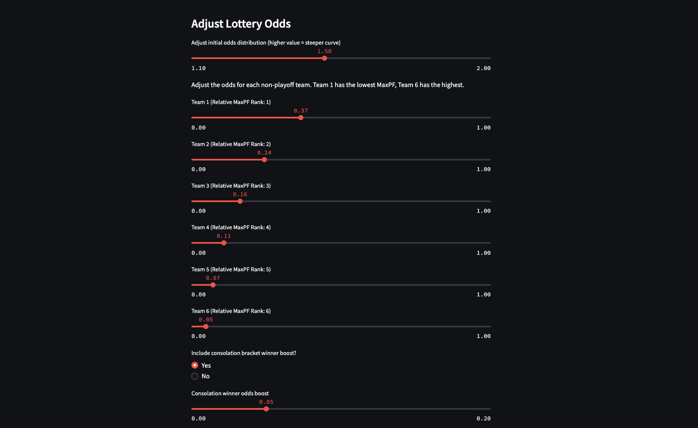

# Dynasty Lottery Simulator
## Simulator for Dynasty League Lottery System

This is a Streamlit app I wrote to simulate different weighting schemes for a dynasty fantasy football league that I am the commissioner for. 

For the uninitiated, in dynasty football, each year you just do a rookie draft to draft newly drafted players in the NFL. We aimed to create a system that achieved the following:

1. More frequently than not, provide the worst performing teams with the best opportunity to draft the 'best' players
2. To reward the winner of the consolation bracket (consisting of teams that did not make the playoffs)
3. Adding some element of randomness for fun

There are a few things going on here:

1. You get to first select how many teams are included in the lottery. We run a 6 team playoff so the top half get to play in a bracket for the championship trophy, and the bottom half play in a consolation bracket for least-bad team. We did not want to create incentives for teams that think they are "sneaking in" to the playoffs to not try to get into the playoffs. These teams would mostly likely be the worst seeded teams and would probably lose in the first round. If we only did lottery for the bottom 6 teams not in the playoffs, it might be worth it to skip the playoffs entirely to get a chance (albeit small) to get a better draft position. So I included a radio button for experimentation with 6-8 team lottery. 
2. There are sliders to adjust the odds for the top 6-8 teams. I also included a slider for the log function which generates the starting distribution of odds so one can make neat looking distributions quickly. The sliders update a graph showing odds for each team, as well as normalized odds showing "probability". 
3. I also added a radio button and slider to adjust the amount of "odds boost" that the consolation bracket winner gets. The odds are adjusted accordingly in the normalized odds as well as in the chart. 

Only a handful of my friends ever even opened the app (being commissioner is a thankless job) and I will probably just end up enforcing my own will on the odds. 
